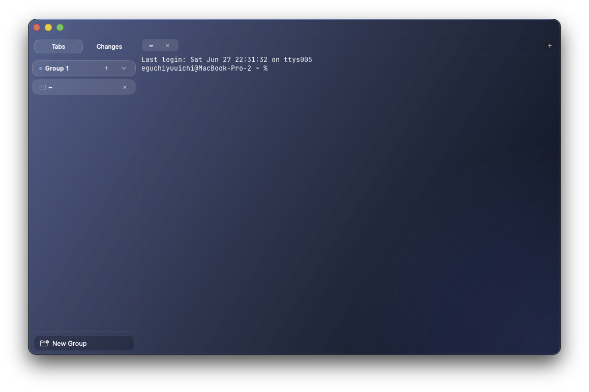

# Calyx

A macOS 26+ native terminal application built on [libghostty](https://github.com/ghostty-org/ghostty) with Liquid Glass UI.



## Features

- **libghostty terminal engine** -- Metal GPU-accelerated rendering via Ghostty v1.3.1 submodule
- **Liquid Glass UI** -- native macOS 26 Tahoe design language with customizable theme color (8 presets + custom hex/color picker; Ghostty preset reads your Ghostty config's background color). Text color adapts automatically: Ghostty preset follows Ghostty's foreground config, other presets switch between white/black based on theme color luminance ([demo video](https://www.youtube.com/watch?v=cUYc7yzI_eM))
- **Tab Groups** -- 10 color presets, collapsible/expandable sections with chevron toggle, double-click to rename groups or individual tabs, drag-to-reorder tabs in tab bar and sidebar
- **Split Panes** -- horizontal and vertical splits with directional focus navigation
- **Command Palette** -- search and execute all operations with `Cmd+Shift+P`
- **Session Persistence** -- tabs, splits, and working directories auto-saved and restored on restart
- **Desktop Notifications** -- OSC 9/99/777 support with rate limiting
- **Browser Integration** -- WKWebView tabs alongside terminal tabs (http/https only, non-persistent storage, popup blocking)
- **Scrollback Search** -- `Cmd+F` to search terminal scrollback with match highlighting, `Cmd+G`/`Cmd+Shift+G` to navigate matches
- **Drag and Drop** -- drag files, URLs, or text onto the terminal to insert content (file paths are shell-escaped)
- **Smooth Scrolling** -- trackpad uses full smooth pixel scrolling via sub-row CALayer transform; notched mouse wheel adds a velocity-based animation for smoother transitions. Togglable in Settings
- **Native Scrollbar** -- system overlay scrollbar for terminal scrollback
- **Cursor Click-to-Move** -- click on a prompt line to reposition cursor (requires shell integration)
- **Git Source Control** -- sidebar Changes view with working changes (staged/unstaged/untracked), commit graph with branch visualization, and inline diff viewer with review comments
- **Diff Review Comments** -- click the gutter `+` button to add inline comments to diff lines, then Submit Review to send directly to a Claude Code, Codex, OpenCode, or Hermes terminal tab
([demo video](https://www.youtube.com/watch?v=_O2Lr4oFf4c))
- **AI Agent IPC** -- MCP server for communication between AI agent instances (Claude Code, Codex CLI, OpenCode, Hermes) across tabs and panes ([demo video](https://www.youtube.com/watch?v=Xty0ad9gGcM))
- **LSP Proxy MCP** -- Calyx hosts language servers (TypeScript, Python, Rust, Go, Swift, and others; 15 in total) as long-lived background processes and exposes 70 LSP tools (`lsp_hover`, `lsp_definition`, `lsp_completion`, `lsp_diagnostics`, etc.) to AI agents over the same MCP server as AI Agent IPC. Missing servers can be auto-installed via Settings. FSEvents pipes disk edits into the server so the agent does not have to manage `didChange` itself. See [LSP Proxy MCP](#lsp-proxy-mcp) for setup.
- **Scriptable Browser** -- 25 CLI commands for browser automation (like cmux): snapshot, click, fill, eval, screenshot, wait, get-attribute, get-links, get-inputs, is-visible, hover, scroll. No enable step needed. `calyx` CLI bundled in the app
- **Ghostty config compatibility** -- reads `~/.config/ghostty/config` (most keys hot-reload on save; see Settings for Calyx-managed keys)
- **Compose Overlay** -- floating text editor over the terminal for comfortable multiline input (`Cmd+Shift+E`), useful for writing long commands or AI prompts ([demo video](https://www.youtube.com/watch?v=qhwYnk8adF4))
- **Quick Terminal** -- system-wide drop-down terminal toggled via global keybind
- **Clipboard Confirmation** -- prompts before pasting potentially unsafe content (respects Ghostty's `clipboard-paste-protection` setting)
- **Secure Keyboard Entry** -- prevents other apps from intercepting keystrokes (toggle via app menu)
- **Auto-update** -- Sparkle-based updates for direct downloads (Homebrew installs use `brew upgrade`)

## Keyboard Shortcuts

### Group Operations (Ctrl+Shift)

| Shortcut | Action |
|---|---|
| `Ctrl+Shift+]` | Next group |
| `Ctrl+Shift+[` | Previous group |
| `Ctrl+Shift+N` | New group |
| `Ctrl+Shift+W` | Close group |

### Tab Operations (Cmd)

| Shortcut | Action |
|---|---|
| `Cmd+T` | New tab |
| `Cmd+W` | Close tab |
| `Cmd+1`--`9` | Switch to tab |
| `Cmd+Shift+]` | Next tab |
| `Cmd+Shift+[` | Previous tab |

### Split Operations

| Shortcut | Action |
|---|---|
| `Cmd+D` | Split right |
| `Cmd+Shift+D` | Split down |
| `Cmd+Option+Arrow` | Focus between splits |

### Search

| Shortcut | Action |
|---|---|
| `Cmd+F` | Find in terminal |
| `Cmd+G` | Next match |
| `Cmd+Shift+G` | Previous match |
| `Escape` | Close search bar |

### Notifications

| Shortcut | Action |
|---|---|
| `Cmd+Shift+U` | Jump to most recent unread notification tab |

### Global

| Shortcut | Action |
|---|---|
| `Cmd+Shift+P` | Command palette |
| `Cmd+Shift+E` | Toggle compose overlay |

### Compose Overlay

| Shortcut | Action |
|---|---|
| `Enter` | Send text to terminal |
| `Shift+Enter` | Insert newline |
| `Escape` | Close overlay |

## IPC (Inter-Pane Communication)

AI agent instances (Claude Code, Codex CLI, OpenCode, Hermes) running in different Calyx tabs or panes can communicate with each other via a built-in MCP server.

1. Open the command palette (`Cmd+Shift+P`) and run **Enable AI Agent IPC**
2. Start agents (Claude Code, Codex, OpenCode, or Hermes) in two or more terminal panes
3. Each instance automatically registers as a peer and can send/receive messages

Config is auto-written to `~/.claude.json`, `~/.codex/config.toml`, `~/.config/opencode/{opencode.json,AGENTS.md}`, and `~/.hermes/config.yaml` when the respective tool is installed. Restart running agent instances to pick up the new MCP server.

Available MCP tools: `register_peer`, `list_peers`, `send_message`, `broadcast`, `receive_messages`, `ack_messages`, `get_peer_status`

To disable, open the command palette and run **Disable AI Agent IPC**.

## LSP Proxy MCP

### Why this exists

CLI coding agents (Claude Code, Codex CLI, Aider) have no language server attached. When you ask them "rename `foo` to `bar`" or "what does this trait do" they fall back to `grep`. Grep doesn't know that `foo` in a comment isn't the same as `foo` in a function call, that `foo` on line 12 is a different binding than `foo` on line 30, or that `MyTrait` has 14 implementations across `target/dependency-source/`. The agent reads back hundreds of false matches and burns tokens trying to disambiguate them.

VSCode-resident AIs (Cursor, Copilot) get to query the IDE's already-warm language server. Calyx gives terminal agents the same access: it runs `typescript-language-server`, `rust-analyzer`, `gopls`, etc. as long-lived background processes and exposes their LSP interface to AI agents over MCP. The agent calls `lsp_definition` and gets the exact source location of a symbol — not text matches; the actual binding the language server resolved.

### What an agent can do with it

| AI task | Without LSP | With LSP Proxy MCP |
|---|---|---|
| "Where is `parseConfig` defined?" | `grep -rn parseConfig` → 80 hits including strings, comments, partial matches in vendored deps. Agent reads each. | `lsp_definition` → 1 location, the actual definition. |
| "Find every caller of `flushBuffer`" | grep again; can't distinguish method calls from property access or string literals. Misses calls through trait objects / interfaces. | `lsp_references` → only true call sites resolved by the type checker. |
| "Rename `cleanupFD` to `closeFD` everywhere" | sed across files; risks renaming inside comments / strings / unrelated identifiers. Agent has to handle conflicts manually. | `lsp_rename` → a single `WorkspaceEdit` describing every textual change the type checker considers safe; agent applies via `lsp_workspace_apply_edit`. |
| "Is this code valid?" | Read the whole file, simulate the type checker in its head. | `lsp_diagnostics` → the real type checker's errors and warnings. |
| "What's the type of this variable?" | Trace the assignment chain manually. | `lsp_hover` → type signature + docs. |
| "What does this function call?" / "Who calls this?" | Recursive grep. | `lsp_call_hierarchy_outgoing` / `_incoming` (or `lsp_symbol_walk` for BFS to a configurable depth). |

### Quick start

1. **Enable the MCP server.** In Calyx, open the command palette (`Cmd+Shift+P`) and run **Enable AI Agent IPC**. Calyx starts an HTTP MCP server on `127.0.0.1:41830` and writes the Bearer token to `~/.claude.json` / `~/.codex/config.toml` / `~/.config/opencode/opencode.json` / `~/.hermes/config.yaml` for whichever CLI agents are installed. Start a new agent process (or reconnect) so it picks up the new MCP catalog.
2. **(Optional) Turn on auto-install.** Settings window → **LSP Proxy**.
    - *Auto-install language servers* — when on, Calyx runs the install command from the registry when a server is missing.
    - *Confirm before each install step* — when on, the agent (or you) is prompted via MCP before each command runs; when off, install runs silently. Both default to on.
3. **Have at least one language server reachable.** Install one yourself (see the language table below) or let Calyx run `lsp_install language_id=<id>` on demand.

### Settings, config, and persistence

- **Settings window → LSP Proxy.** Two toggles described above.
- **PATH for GUI launches.** macOS GUI apps inherit a minimal `PATH` (`/usr/bin:/bin:/usr/sbin:/sbin`) that excludes Homebrew, npm-global, `~/.cargo/bin`, and `~/go/bin`. Calyx automatically extends `PATH` with the conventional user dirs (`/opt/homebrew/bin`, `/usr/local/bin`, `~/.cargo/bin`, `~/.npm-global/bin`, `~/go/bin`, `~/.ghcup/bin`, `~/.opam/default/bin`, `/usr/local/share/dotnet`, `/usr/local/go/bin`) for every probe and install command, so language servers installed via brew / npm / cargo / rustup / go / opam are found even when Calyx is launched from Finder.
- **User overrides.** `~/.config/calyx/lsp.json` overrides or adds registry entries. The file matches the registry entry shape; each entry is a whole replacement (matching on `languageId`), not a partial merge — list every required field. Schema:

    ```json
    {
      "entries": [
        {
          "languageId": "rust",
          "displayName": "Rust",
          "executable": "rust-analyzer",
          "arguments": [],
          "fileExtensions": [".rs"],
          "workspaceMarkers": ["Cargo.toml"],
          "installation": {
            "command": "rustup component add rust-analyzer",
            "prerequisites": [],
            "safeToAutoRun": true
          }
        }
      ]
    }
    ```

    A matching `languageId` replaces the built-in entry entirely; a new `languageId` is added to the registry.
- **Session persistence.** Calyx remembers which files were open per `(workspace_root, language_id)` and replays `didOpen` for them on restart. Workspace roots are canonicalized via `URL.resolvingSymlinksInPath().standardizedFileURL`, so `/tmp/foo` and `/private/tmp/foo/` map to the same persistence row.
- **Idle shutdown.** A session with no LSP traffic for 30 minutes is shut down; the next tool call respawns it.

### How it works

`tools/list` on the `calyx-ipc` MCP server returns IPC tools (`register_peer`, etc.) and LSP tools in one catalog. On the first `lsp_*` call for a given `(workspace_root, language_id)`, Calyx spawns the matching language server, runs the `initialize` / `initialized` handshake, captures static and dynamic capabilities, and keeps the session warm. `FileSyncManager` (FSEvents) attaches a recursive watcher to the workspace root and pipes file events (created / modified / deleted / renamed) into `textDocument/didChange` and `workspace/didChangeWatchedFiles`, so the server sees what's on disk without the agent having to issue sync notifications.

### Supported languages

| Language | Server | Install command |
|---|---|---|
| TypeScript / JavaScript | typescript-language-server | `npm i -g typescript-language-server typescript` |
| Python | Pyright | `npm i -g pyright` |
| Swift / Objective-C / C / C++ | SourceKit-LSP | Probed via `xcrun -f sourcekit-lsp`; install Xcode or `xcode-select --install` |
| Rust | rust-analyzer | `rustup component add rust-analyzer` (prereq: `rustup` via `curl --proto '=https' --tlsv1.2 -sSf https://sh.rustup.rs \| sh`) |
| Go | gopls | `go install golang.org/x/tools/gopls@latest` |
| Ruby | Ruby LSP | `gem install ruby-lsp` |
| Java | jdtls | `brew install jdtls` |
| Kotlin | kotlin-language-server | `brew install fwcd/kls/kotlin-language-server` |
| PHP | Intelephense | `npm i -g intelephense` (commercial license required for non-trial features) |
| C# | csharp-ls | `dotnet tool install -g csharp-ls` (prereq: `brew install --cask dotnet-sdk`) |
| Lua | lua-language-server | `brew install lua-language-server` |
| Elixir | elixir-ls | `brew install elixir-ls` |
| Haskell | HLS | `ghcup install hls` |
| Zig | zls | `brew install zls` |
| OCaml | ocaml-lsp | `opam install ocaml-lsp-server` |

`lsp_check_installation` reports whether each binary is on `PATH` for the running Calyx process. Swift uses `xcrun -f sourcekit-lsp` (the actual probe), so a Mac with `xcrun` but no Command Line Tools still reports Swift as not installed. `lsp_install language_id=<id>` triggers the install command above (subject to the Settings toggles). Pass `approve_prerequisites=true` to chain-install missing prerequisites first.

### MCP tools

70 `lsp_*` tools are exposed in `tools/list` (combined with 7 IPC tools = 77 total). They group as follows; see `tools/list` for full input schemas.

- **Navigation:** `lsp_hover`, `lsp_definition`, `lsp_declaration`, `lsp_type_definition`, `lsp_implementation`, `lsp_references`, `lsp_document_highlight`, `lsp_document_symbol`, `lsp_workspace_symbol`, `lsp_workspace_symbol_resolve`.
- **Completion / signatures:** `lsp_completion`, `lsp_completion_resolve`, `lsp_signature_help`.
- **Edit / refactor:** `lsp_prepare_rename`, `lsp_rename`, `lsp_code_action`, `lsp_code_action_resolve`, `lsp_formatting`, `lsp_range_formatting`, `lsp_on_type_formatting`, `lsp_workspace_execute_command`, `lsp_workspace_apply_edit`. `lsp_code_action` accepts `diagnostics`, `only`, and `trigger_kind` arguments so quickfix-style requests can match diagnostics at a range.
- **Diagnostics:** `lsp_diagnostics`, `lsp_diagnostics_diff` (incremental polling with snapshot pruning), `lsp_workspace_diagnostic_pull`.
- **Hierarchies / monikers:** `lsp_call_hierarchy_prepare` / `_incoming` / `_outgoing`, `lsp_type_hierarchy_prepare` / `_supertypes` / `_subtypes`, `lsp_moniker`.
- **Visualization:** `lsp_code_lens` / `_resolve`, `lsp_inlay_hint` / `_resolve`, `lsp_inline_value`, `lsp_folding_range`, `lsp_selection_range`, `lsp_semantic_tokens_full` / `_range` / `_delta`, `lsp_linked_editing_range`, `lsp_document_link` / `_resolve`, `lsp_document_color`, `lsp_color_presentation`.
- **File-operation hooks:** `lsp_will_create_files` / `lsp_did_create_files` / `lsp_will_rename_files` / `lsp_did_rename_files` / `lsp_will_delete_files` / `lsp_did_delete_files`.
- **Workspace configuration:** `lsp_workspace_configuration_get` / `_set`.
- **Notebook documents:** `lsp_notebook_did_open` / `_did_change` / `_did_close`.
- **Session lifecycle:** `lsp_session_status`, `lsp_session_warmup`, `lsp_session_shutdown`, `lsp_check_installation`, `lsp_install`, `lsp_install_status`, `lsp_capabilities`.
- **AI-specific helpers:**
    - `lsp_batch` pipelines several tool calls in one MCP request.
    - `lsp_hover_bundle` returns hover + definition + the source slice around the cursor + `dependent_types` (hover info for up to 5 type identifiers referenced in the signature) + `doc_comment` (the prose portion of the hover markdown) in one round trip. Pass `context_lines` (default 10) for the surrounding source window.
    - `lsp_symbol_walk` does a BFS over the call or type hierarchy up to `depth` hops (default 1, max 5). Pass `kind`: `call_incoming` (default), `call_outgoing`, `type_supertypes`, or `type_subtypes`. Returns `{ items: [{level, item, edge?}], depth_reached }`.
    - `lsp_cross_workspace_definition` first dispatches `textDocument/definition` in the requested workspace; on an empty result it asks `textDocument/moniker` and fans `workspace/symbol` across every warm session, returning `{ resolved_in, definition, cross_workspace: [{workspace, locations}] }`.
    - `lsp_global_workspace_symbol` aggregates `workspace/symbol` results across every warm session.

Every tool accepts `workspace_root` and `language_id`. Position-bearing tools take `file`, `line`, `column` (0-based, UTF-16 code-unit columns per LSP). `file` accepts either a plain absolute path or a `file://` URI; both are normalized to the same percent-encoded URI for the session. Calyx auto-issues `textDocument/didOpen` for the target file when the session hasn't seen it yet.

### Troubleshooting

- **`lsp_check_installation` reports installed but `lsp_hover` fails.** The default `which` probe can be fooled by a shim that exists on `PATH` but is non-functional (e.g. a `rustup` shim without the `rust-analyzer` component). Swift specifically probes via `xcrun -f sourcekit-lsp` for this reason; other languages use plain `which`. Resolve by running the install command yourself once.
- **Sourcekit-LSP returns "No language service for ..." on Xcode projects.** Sourcekit-LSP requires either a `Package.swift` workspace or a `compile_commands.json`. Open the Swift Package Manager root, not the `.xcodeproj` parent.
- **MCP server doesn't appear in your agent.** Restart the agent process. Calyx writes the MCP config when **Enable AI Agent IPC** runs, but most agents read MCP config at startup only.
- **Auto-install fails with "auto-install disabled in Settings".** Open the Settings window → LSP Proxy and toggle *Auto-install language servers* on. The error is explicit by design so the caller can distinguish "user declined" from "feature disabled".
- **Verify the wiring.** With AI Agent IPC enabled, run `./scripts/lsp-mcp-smoke-test.sh` from the repository checkout. It checks `tools/list` returns 77 entries (7 IPC + 70 LSP) and that a few representative `lsp_*` tools dispatch cleanly.

## Browser Scripting

Agents can programmatically control browser tabs via 25 CLI commands, similar to cmux's browser automation.

1. Open a browser tab and navigate to a page
2. Use `calyx browser` commands from any terminal tab — no enable step needed

### CLI Commands

```bash
calyx browser list                         # List all browser tabs
calyx browser snapshot --tab-id <id>       # Accessibility tree with element refs
calyx browser get-text h1 --tab-id <id>    # Get element text
calyx browser click a --tab-id <id>        # Click element
calyx browser fill input --value "text"    # Fill input field
calyx browser eval 'document.title'        # Execute JavaScript
calyx browser screenshot                   # Capture to temp file
calyx browser wait --selector ".loaded"    # Wait for condition
calyx browser get-attribute a href         # Get element attribute
calyx browser get-links                    # List all links (JSON)
calyx browser get-inputs                   # List all form inputs (JSON)
calyx browser is-visible '#sidebar'        # Check element visibility
calyx browser hover '#menu-item'           # Hover over element
calyx browser scroll down --amount 500     # Scroll page/element
```

The `calyx` CLI binary is bundled inside `Calyx.app/Contents/Resources/bin/`. To install it to your PATH, run **Install CLI to PATH** from the command palette.

The browser server starts automatically with the app and listens on `localhost:41840`. Connection info is written to `~/.config/calyx/browser.json`.

## Installation

### Homebrew

```bash
brew tap yuuichieguchi/calyx
brew install --cask calyx
```

### Manual

1. Download `Calyx.zip` from the [latest release](https://github.com/yuuichieguchi/Calyx/releases/latest)
2. Unzip the file
3. Drag `Calyx.app` into `/Applications`

Direct downloads include automatic update checking via Sparkle. Homebrew installs are updated via `brew upgrade`.

## Building from Source

### Prerequisites

- macOS 26+ (Tahoe)
- Xcode 26+
- [Zig](https://ziglang.org/) (version matching ghostty's `build.zig.zon`)
- [XcodeGen](https://github.com/yonaskolb/XcodeGen) (`brew install xcodegen`)

## Building

```bash
# Clone with submodules
git clone --recursive https://github.com/yuuichieguchi/Calyx.git
cd Calyx

# Build libghostty xcframework
cd ghostty
zig build -Demit-xcframework=true -Dxcframework-target=native
cd ..

# Copy framework
cp -R ghostty/macos/GhosttyKit.xcframework .

# Generate Xcode project & build
xcodegen generate
xcodebuild -project Calyx.xcodeproj -scheme Calyx -configuration Debug build
```

## Architecture

Calyx uses AppKit for window, tab, and focus management with SwiftUI for view rendering, bridged via `NSHostingView`.

- All ghostty C API calls go through the `GhosttyFFI` enum
- `@MainActor` enforced on all UI and model code
- Action dispatch via `NotificationCenter`

**Tech stack**: Swift 6.2, AppKit, SwiftUI, libghostty (Metal), XcodeGen

## Known Limitations

- **Cursor click-to-move on full-width text** -- cursor placement may be offset on Japanese/full-width text lines because Ghostty's cursor-click-to-move internally translates clicks into arrow-key steps over terminal cells.
- **Calyx-managed config keys** -- `background-opacity`, `background-blur`, `background-opacity-cells`, `font-codepoint-map`, `foreground` are overridden by Calyx for Glass UI. See Settings > Ghostty Config Compatibility for the full list.

## License

This project is licensed under the [MIT License](LICENSE).

## Acknowledgements

Built on [libghostty](https://github.com/ghostty-org/ghostty) by Mitchell Hashimoto (MIT License).

